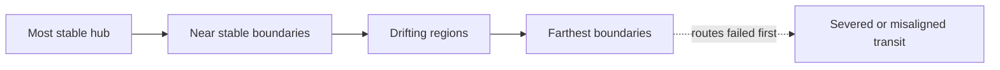

---
aliases:
  - World Map Structure
tags:
  - boundarybend/design
  - boundarybend/world-structure
status: developing
---

# Open World Structure

## The circular world

The game world is circular. This is now an established structural decision rather than one optional layout among many.

The circle supplies a predictable coordinate system without requiring the current map to settle every region immediately:

- a place or event can occupy an angle around the world;
- additional authored material can use outward overlay lanes when one arc becomes crowded;
- connections can follow the circumference, cross a chord, or move between lanes;
- the same normalized relationship survives zooming and map expansion; and
- notes can sit directly over the world map instead of being copied into a separate quest diagram.

The [[World/Places/Traveler Legacy Hub/00 Traveler Legacy Hub Index|Traveler Legacy Hub]] is the organizing center of the current world map. This reflects its role as the realm's stable point without demanding that every geographic measurement begin there. Other Place anchors can continue outward around it as the curated world grows.

## A center of stability, not necessarily geography

The [[World/Places/Traveler Legacy Hub/00 Traveler Legacy Hub Index|Traveler Legacy Hub]] occupies the most stable point known to the Original Travelers. The open world does not need to place it at the literal center of a conventional radial map.

Recommended interpretation: the hub is the **topological center of stability**. Its importance comes from reliable relationships to boundaries, routes, and the growth current—not equal walking distance from the map's four corners.

This permits a visually and spatially unusual layout while preserving the role of a Firelink-like refuge.

The diagram describes stability relationships, not mandatory geographic placement.

## The old network as world structure

The Original Travelers built multiple transportation systems from the hub to even the farthest boundaries. Their collapse can organize exploration:

- intact local routes establish the hub's inherited convenience;
- damaged intermediate routes reveal that stability is uneven;
- the earliest failures mark the farthest or most weakly aligned boundaries;
- alternate paths expose regions the old network treated as stops rather than lived places; and
- route technology becomes evidence of how the Travelers understood the realm.

The player need not simply repair every line. Some routes may be obsolete because the world no longer has the relationships for which they were designed.

## Relational overlays inside the circle

### Folded stability map — recommended

Geographically distant areas may be adjacent through a stable boundary, while nearby places are difficult to reach because their relationship has drifted. The hub can sit off-center on the drawn map while remaining central to traversal.

### Broken spokes

The hub anchors several major corridors. Outer spokes failed first, leaving partial routes and isolated regional networks. Clear and readable, though visually closer to familiar hub-and-spoke design.

### Layered boundaries

Regions occupy nested or overlapping boundary conditions rather than concentric geography. Progress means learning which layer a route belongs to, not simply moving farther from the center.

These are relational overlays on the circular world, not competing overall map shapes.

## Design consequences

- Distance should sometimes be relational rather than measured only in terrain.
- Transportation failure should communicate cosmology and history, not function merely as a locked door.
- The hub's safety must feel materially real without proving its culture morally or intellectually superior.
- The new issue should eventually expose assumptions the old network cannot accommodate.
- Reaching a boundary should change the player's understanding of the map, not only reveal another biome.

## Open decisions

- Whether routes are mechanical vehicles, portals, moving structures, boundary alignments, or several systems
- Whether the player repairs, replaces, reroutes, or abandons them
- Whether the hub remains fixed while the realm drifts around it
- What “farthest” means when cosmological distance and geographic distance disagree
